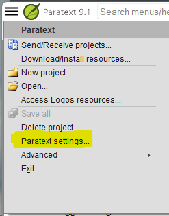
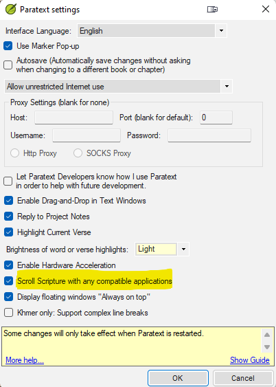

# ScrollParatext
Proof of Concept showing how to scroll Paratext & Logos with verse changes (both incoming and outgoing)

### Requirements

In Paratext, you must enable the ability to syncronize the scrolling to other applications.  First go to your 'Paratext Settings' menu item:

Once inside of the settings panel, make sure that the 'Scroll Scripture with any compatible applications' menu item is checked:

### Using Notes

Only those items of the same Scroll Group (A, B, C, ...) will scroll together.

### Code Notes

The WinForms application is relatively straightforward. However outside of WinForms, you have to do a trick in the .csproj file to be able to reference the MESSAGES library (which is found in WinForms). In the ScrollParatext.Messages library (which is .NET 5 libaray), add this to the .csproj in the `<PropertyGroup>` secion: `<UseWindowsForms>true</UseWindowsForms>`